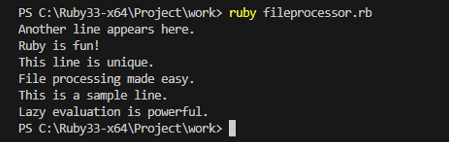
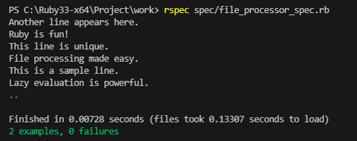

# 📝 FileProcessor — Унікальні рядки з файлу

## 🛠 Умови завдання
Реалізувати програму, яка:
1. Зчитує великий текстовий файл.
2. Повертає лише унікальні рядки, використовуючи **lazy evaluation**.
3. Забезпечує перевірку функціональності за допомогою тестів, написаних з використанням **RSpec**.

---

## ✨ Що було зроблено
- Розроблено клас `FileProcessor`, який зчитує текстовий файл построчно та повертає унікальні рядки за допомогою lazy evaluation. 
- Написані тести для перевірки роботи програми, які:
  - Переконуються, що повертаються лише унікальні рядки.
  - Перевіряють використання lazy evaluation. 


---

## 📸 Результат роботи програми
Програма обробляє файл `text.txt` і повертає лише унікальні рядки. Ось приклад її роботи:

### Вхідний файл:
```
Another line appears here.
Ruby is fun!
Another line appears here.
This line is unique.
File processing made easy.
This is a sample line.
This is a sample line.
File processing made easy.
File processing made easy.
Another line appears here.
This line is unique.
This line is unique.
Another line appears here.
File processing made easy.
This line is unique.
Ruby is fun!
Lazy evaluation is powerful.
Lazy evaluation is powerful
...
```

### Вихід програми:




---

## ✅ Результат тестів
Тести написані за допомогою RSpec для перевірки коректності роботи програми. Усі тести успішно проходять:




---

## 📂 Структура проєкту
```
.
├── FileProcessor.rb       # Основний клас програми
├── text.txt               # Тестовий текстовий файл
├── spec/
│   ├── file_processor_spec.rb  # Тести RSpec
│   └── spec_helper.rb
└── README.md              # Опис проєкту
```

